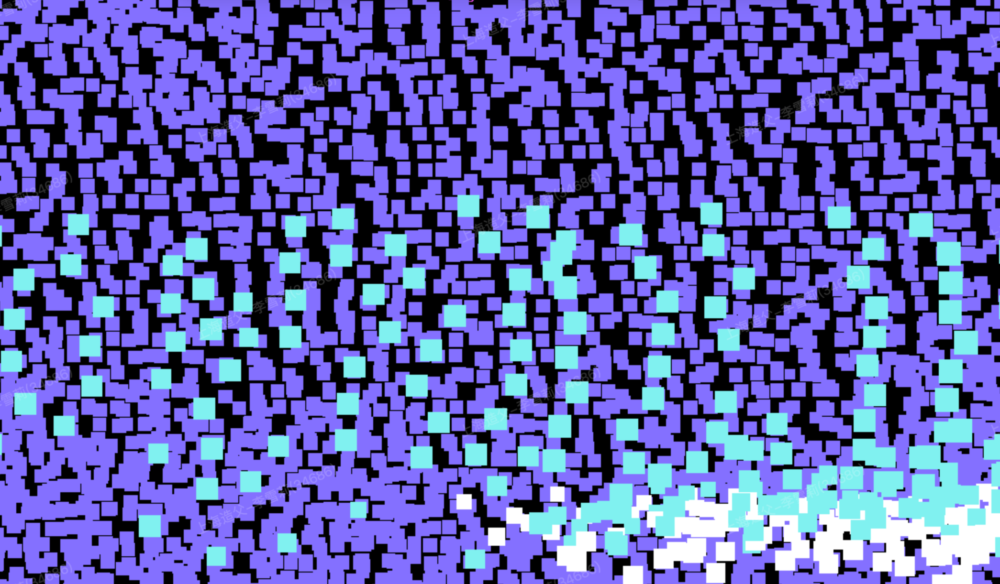
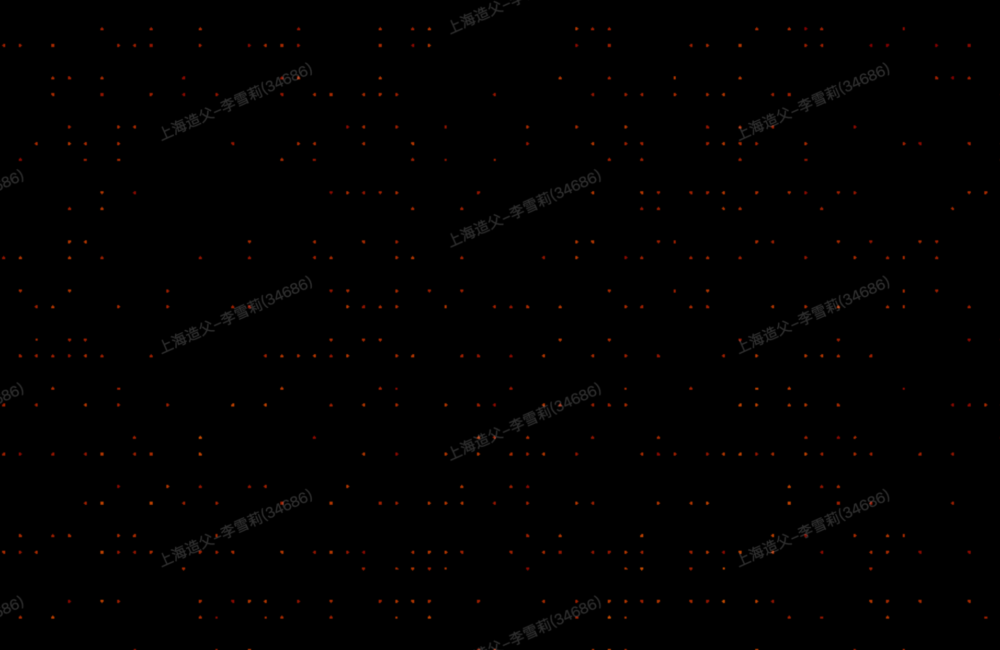

# 公式落笔，像素生花
### Shader 入门魔术揭秘

<div class="pt-8 opacity-70">
没有图片 · 没有粒子 · 没有动画文件 —— 只有几十行数学公式
</div>

<div class="abs-br m-6 text-sm opacity-50">
周会技术分享 · 按 → 翻页
</div>

<!--
开场别急着讲概念。先卖个关子：这页之后会放两段成品，让大家先"哇"一下再揭秘。
自我打气：Shader 是"人人听过、极少人真写过"的技能，今天我以学习者视角带大家看，反而更接地气。
-->

---
layout: center
class: text-center
---

<div class="insert-box">

<div class="insert-head">
  <div class="insert-rx">℞</div>
  <div>
    <div class="insert-title">Shirley 的「工作使用说明书」</div>
    <div class="insert-sub">OTC · 非处方型同事 · 对接前请仔细阅读本说明书</div>
  </div>
  <div class="insert-tag">ISFJ</div>
</div>

<div class="grid grid-cols-2 gap-x-6 gap-y-3 text-left mt-4">

<div class="insert-item" v-click>
  <div class="insert-label">【主要成分】</div>
  甘肃籍 <b>白羊座</b> 一枚 · MBTI <b>ISFJ</b>（守护者型）<br/>
  <span class="opacity-60 text-xs">川大本硕连读 7 年<b>火锅、串串</b> + 海量<b>碳水（面食）</b>熬制而成，本体疑似面做的，性质温和、责任心含量偏高</span>
</div>

<div class="insert-item" v-click>
<div class="insert-label">【适应症】</div>
适用于需要<b>靠谱交付</b>、<b>认真对接</b>、<b>把事办妥</b>的场景<br/>
<span class="opacity-60 text-xs">对"差不多就行"类需求疗效一般</span>
</div>

<div class="insert-item" v-click>
<div class="insert-label">【用法用量】</div>
对接需求<b>把话说清楚</b>：要什么、为什么、到几号<br/>
描述问题也请<b>讲明白</b>：现象、复现步骤、期望结果<br/>
<span class="opacity-60 text-xs">信息越完整，起效越快、副作用越小</span>
</div>

<div class="insert-item" v-click>
<div class="insert-label">【副作用】</div>
偶发<b>受惊吓反应</b>（突然拍肩 / 大声喊名字慎用）<br/>
<span class="opacity-60 text-xs">说话<b>比较直接</b>，非冒犯，属正常药理现象</span>
</div>

</div>

<div class="insert-warn mt-3 text-left" v-click>
<b>⚠ 注意事项：</b>请勿模糊投喂需求；如出现「这个你懂的吧」、「你先把他做出来」症状，请立即补充上下文。本品建议长期同事关系内规律服用，效果更佳。
</div> 

</div>

<style>
.insert-box {
  max-width: 760px;
  margin: 0 auto;
  background: #fffdf5;
  border: 2px solid #2b2b2b;
  border-radius: 10px;
  padding: 20px 24px;
  box-shadow: 6px 6px 0 rgba(0,0,0,0.12);
  color: #1f1f1f;
}
.insert-head {
  display: flex;
  align-items: center;
  gap: 14px;
  border-bottom: 2px dashed #c0392b;
  padding-bottom: 12px;
}
.insert-rx {
  font-size: 40px;
  font-weight: 800;
  color: #c0392b;
  line-height: 1;
}
.insert-title { font-size: 26px; font-weight: 800; }
.insert-sub { font-size: 12px; opacity: 0.6; margin-top: 2px; }
.insert-tag {
  margin-left: auto;
  background: #c0392b;
  color: #fff;
  font-weight: 700;
  font-size: 13px;
  padding: 4px 10px;
  border-radius: 6px;
  letter-spacing: 1px;
}
.insert-item {
  font-size: 14px;
  line-height: 1.45;
}
.insert-item,
.insert-warn {
  transition: opacity 0.4s ease, transform 0.4s ease;
}
.insert-item.slidev-vclick-hidden,
.insert-warn.slidev-vclick-hidden {
  opacity: 0;
  transform: translateY(12px);
}
.insert-label {
  font-weight: 800;
  color: #c0392b;
  margin-bottom: 2px;
}
.insert-warn {
  font-size: 12.5px;
  background: #fff3cd;
  border: 1px solid #e0c068;
  border-radius: 6px;
  padding: 8px 12px;
  color: #6b5400;
}
</style>

<!--
这页是轻松的自我介绍，用药品说明书的口吻讲。
节奏：先指着 ℞ 和"非处方型同事"逗一下，再快速念几条。重点强调【用法用量】——需求说清楚，和【副作用】——别突然吓我、说话直但不是针对人。
念完一句"本品长期服用效果更佳"收尾，自然过渡到正题。

生活中的话，比如兴趣爱好啊、追什么剧啊（最近喜欢看一些英美剧）等，只能等鹏哥带我们团建，大家都切换成生活面孔的时候再来相互了解吧hh

期待看到其他同事的“使用说明书”
-->

---
layout: center
class: text-center
---

# 先看两个成品

<div class="grid grid-cols-2 gap-4 mt-4">
  <ShaderEditor preset="starfield" :height="360" :codeRatio="0" :only="['gradient','starfield','fire','mouse']" />
  <ShaderEditor preset="fire" :height="360" :codeRatio="0" :only="['gradient','starfield','fire','mouse']" />
</div>

<div class="mt-4 text-xl">
这两个画面里，<b>连半张图片都没有</b>。这团火，其实就是几十行数学公式"烧"出来的。<br/>
<span class="opacity-70">猜猜看，这是怎么做到的？</span>
</div>

<!--
让大家盯着看 5 秒，火焰是动的、星星在闪。
抛问题："这要是用图片/视频做，得多大？" —— 答案是这俩加起来不到 2KB 文本。
-->

---
layout: center
class: text-center
---

# 到底什么是 Shader 和 GLSL？

<div class="grid grid-cols-2 gap-8 mt-8 text-left">

<div v-click class="bg-gray-50 dark:bg-gray-800 p-6 rounded-lg shadow-sm border border-gray-200 dark:border-gray-700">
<h3 class="text-xl font-bold text-blue-500 mb-2">🎮 Shader (着色器)</h3>
<p class="text-sm opacity-80 mb-2"><b>它是一个跑在 GPU 上的“小程序”。</b></p>
<ul class="text-sm space-y-2 opacity-80 list-disc pl-4">
  <li>平时写的 JS 是跑在 CPU 上的，管业务逻辑。</li>
  <li>Shader 是直接丢给显卡（GPU）执行的，专门用来<b>算屏幕上每个像素该显示什么颜色</b>。</li>
  <li>因为是硬件级加速，所以它快得离谱。</li>
</ul>
</div>

<div v-click class="bg-gray-50 dark:bg-gray-800 p-6 rounded-lg shadow-sm border border-gray-200 dark:border-gray-700">
<h3 class="text-xl font-bold text-green-500 mb-2">💻 GLSL</h3>
<p class="text-sm opacity-80 mb-2"><b>全称 OpenGL Shading Language。</b></p>
<ul class="text-sm space-y-2 opacity-80 list-disc pl-4">
  <li>就是用来写 Shader 的<b>编程语言</b>。</li>
  <li>长得特别像 C 语言（有 <code>float</code>、<code>vec2</code>、<code>void main()</code>）。</li>
  <li>它没有 <code>console.log</code>，也没有断点调试，全靠肉眼看颜色找 Bug。</li>
</ul>
</div>

</div>

<div v-click class="mt-8 text-lg font-medium">
“今天咱们不搞硬核的图形学理论，<br/>就当是来看一场<span class="text-orange-500">用数学公式作画</span>的魔术揭秘。”
</div>

<!--
【口播脚本】
在揭秘之前，先用大白话对齐一下概念。
Shader 翻译过来叫着色器，听着很高级，其实就是一段跑在显卡（GPU）上的小程序，唯一的工作就是算颜色。
GLSL 呢，就是写这个小程序的语言。它长得像 C 语言，最痛苦的是不能 console.log，全靠肉眼调试。
不过别担心，今天咱们不搞硬核理论，大家就当看一场魔术揭秘。
-->

---
layout: default
---

# 既然这么难写，为什么还要用 Shader？

<div class="mt-4 text-sm opacity-80">
既然连 <code>console.log</code> 都没有，为什么业界还要死磕这玩意儿？<br/>
答案就一个字：<b>快！</b> 它可以瞬间处理海量像素，还能“无中生有”。
</div>

<div class="grid grid-cols-2 gap-8 mt-8">

<div v-click class="space-y-2">
  <div class="flex items-center gap-2 text-lg font-bold text-orange-500">
    <div class="i-carbon-gamepad text-2xl"></div>
    游戏与 3D 引擎的“灵魂”
  </div>
  <p class="text-sm opacity-80 pl-8">
    你玩 3A 大作里<b>波光粼粼的水面、逼真的光影、爆炸的火花</b>，全都是 Shader 算出来的。没有它，3D 世界就是一堆灰白色的塑料块。
  </p>
</div>

<div v-click class="space-y-2">
  <div class="flex items-center gap-2 text-lg font-bold text-blue-500">
    <div class="i-carbon-magic-wand text-2xl"></div>
    图像与视频滤镜
  </div>
  <p class="text-sm opacity-80 pl-8">
    抖音/美颜相机里的<b>瘦脸、磨皮、赛博朋克滤镜</b>，本质上就是写了一个 Shader，把摄像头的像素颜色重新算了一遍。
  </p>
</div>

<div v-click class="space-y-2">
  <div class="flex items-center gap-2 text-lg font-bold text-purple-500">
    <div class="i-carbon-chart-3d text-2xl"></div>
    海量数据可视化
  </div>
  <p class="text-sm opacity-80 pl-8">
    比如咱们 <b>SAIL 的点云编辑器</b>！几百万个激光雷达点，用 CPU 画早就卡死了。交给 Shader，显卡眼都不眨一下就能给你渲染得明明白白。
  </p>
</div>

<div v-click class="space-y-2">
  <div class="flex items-center gap-2 text-lg font-bold text-green-500">
    <div class="i-carbon-color-palette text-2xl"></div>
    酷炫的网页 UI 动效
  </div>
  <p class="text-sm opacity-80 pl-8">
    苹果官网那种<b>丝滑的流体背景、鼠标跟随的粒子特效</b>。不用加载几十兆的视频，几行代码就能搞定，还不占网络带宽。
  </p>
</div>

</div>

<!--
【口播脚本】
既然 Shader 连个断点都打不了，为什么大家还要死磕？因为它的性能是降维打击。
它的应用场景其实就在我们身边：
1. 游戏里的光影、水面、火焰，全靠它。
2. 大家天天用的抖音滤镜、美颜瘦脸，本质上就是跑了个 Shader。
3. 网页上那种特别高级的动态背景、鼠标特效。
4. 最重要的是，咱们自己的 SAIL 平台！几百万个点云，全靠 Shader 在底层疯狂算颜色，不然浏览器早崩了。
所以，掌握一点 Shader 思维，其实能帮我们打开一扇新世界的大门。
-->

---
transition: fade
---

# 思维转弯
## 别把自己当「画家」，你现在是「像素包工头」

<div class="grid grid-cols-2 gap-8 mt-6">
<div v-click>

### 传统画画
<span class="text-xs opacity-60">≈ 命令式 imperative：一步步告诉它「怎么做」</span>

我拿笔，**一笔一笔**慢慢画。

```js
for (const pixel of allPixels) {
  draw(pixel)   // 一个一个来
}
```

CPU 就像个老实人，几百万个像素只能苦哈哈地排队等。

</div>
<div v-click>

### Shader 思维
<span class="text-xs opacity-60">≈ 声明式 declarative：只声明「是什么」，不写循环</span>

我定**一条规矩**，GPU 直接让几百万个像素<br/>**同时**开干。

```glsl
// 我只描述「任意一个像素」该长啥样
// GPU 把它并行套用到每个像素
```

这时候，每个像素只做直击灵魂的拷问：
</div>
</div>

<div v-click class="mt-8 text-center text-3xl font-black tracking-widest text-transparent bg-clip-text bg-gradient-to-r from-red-500 via-orange-400 to-yellow-400 drop-shadow-lg transform transition-all duration-500 hover:scale-110">
「我在屏幕的哪个位置？我该是什么颜色？」
</div>

<!--
这是全场最重要的 Aha 时刻，慢一点讲。
打比方1（并行）：CPU 像一个超级聪明的人按顺序做题；GPU 像几千个小学生同时各做一道简单题。画面几百万像素，GPU 几乎"一瞬间"全算完。
打比方2（编程范式，给写代码的同学）：左边 for 循环是"命令式"——我命令程序一步步遍历、怎么做都写死；右边写 shader 是"声明式"——我只声明"任意一个像素 = 什么颜色"这条规则，至于怎么遍历几百万像素、并行调度，交给 GPU，我不管。
类比熟悉的场景：SQL（声明你要什么数据，不写遍历）、React（声明 UI 长什么样，不手动操作 DOM）——shader 就是"声明每个像素的颜色"。注意这是类比、帮助理解，本质上 shader 是 SIMD 并行执行，不是严格意义的声明式语言。
-->

---
layout: two-cols
layoutClass: gap-6
---

# 举个栗子 🌰
## ① 渐变 · 逐行拆解

```glsl {all|1|3-4|7|9|11}{lines:true, maxHeight:'360px'}
precision mediump float;

uniform vec2  u_resolution;
uniform float u_time;

void main() {
  vec2 uv = gl_FragCoord.xy / u_resolution.xy;

  vec3 color = vec3(uv.x, uv.y, abs(sin(u_time)));

  gl_FragColor = vec4(color, 1.0);
}
```

::right::

<v-clicks at="1">

- **精度声明**：GLSL 规矩，得先声明浮点精度。别管为什么，每次照抄就行。

- **uniform = 外部输入**：这是 JS 世界给 GPU 递的小纸条，每个像素拿到的都一样。`u_resolution` 是画布大小，`u_time` 就是时间。

- **位置归一化**：`gl_FragCoord` 是当前像素的绝对坐标，除以尺寸就变成了 `0~1` 的 `uv` 坐标。这步在 shader 里基本是起手式。

- **位置即颜色**：把横坐标 `uv.x` 当红色、纵坐标 `uv.y` 当绿色，蓝色再套个 `sin(u_time)` 随时间喘气儿。就这么一映射，渐变就出来了。

- **输出颜色**：每个像素**必须**老老实实给 `gl_FragColor` 交差，赋一个 `vec4(R,G,B,A)`。打完收工。

</v-clicks>

<!--
节奏：点一下 → 高亮一段 → 念右边注释 → 再点。
重点强调第 3、4 步：uv 归一化 + 位置当颜色，这是后面星空/火焰的共同地基。
讲完可切到下一页的可编辑版本，让大家看着改 uv.x → uv.y。
-->

---

#  😏【互动】· 自己动手改

试着把 `uv.x` 改成 `uv.y`，或者把 `abs(sin(u_time))` 换成 `0.5` 玩玩看
<ShaderEditor preset="gradient" :height="400" :only="['gradient','starfield','fire','mouse']" />

<!--
现场互动：让观众喊一个数字/改法，你当场改，画面立刻变。
故意写错一个分号，展示底部红色报错，引出"GLSL 类型很严格"。
-->

---
layout: center
class: text-center
---

# 从「简单渐变」到「星空火焰」的距离

<div class="mt-6 text-lg opacity-80">
刚才的渐变只是热身，让我们熟悉了 GPU 的脑回路。<br/>
但要画出开场那种复杂的星空和火焰，几十行代码真的够吗？
</div>

<div v-click class="mt-8 text-2xl font-bold text-orange-500">
不用急，让我们先备好 4 块“积木”。
</div>

<div v-click class="mt-6 text-lg opacity-80">
后面的满天繁星和熊熊烈火，全靠这 4 个工具函数拼出来：<br/>
<div class="mt-4 flex justify-center gap-4 text-xl">
  <code class="bg-gray-100 dark:bg-gray-800 px-3 py-1 rounded text-red-500">step</code>
  <code class="bg-gray-100 dark:bg-gray-800 px-3 py-1 rounded text-blue-500">smoothstep</code>
  <code class="bg-gray-100 dark:bg-gray-800 px-3 py-1 rounded text-green-500">mix</code>
  <code class="bg-gray-100 dark:bg-gray-800 px-3 py-1 rounded text-yellow-500">noise</code>
</div>
</div>

<!--
【口播过渡】
“刚才的渐变只是让大家感受一下 GPU 是怎么算颜色的。
但大家可能会想：从这么简单的渐变，到开场那种星空、火焰，跨度是不是太大了？是不是得写几千行代码？
其实一点都不大。在 Shader 的世界里，复杂效果都是搭积木搭出来的。
接下来，我们先花两分钟认识一下这 4 块核心积木。认识了它们，后面的星空和火焰你一眼就能看懂。”
-->

---
class: overflow-y-auto
---

# 工具 1：`step(edge, x)`

**无情的开关**：拿 `x` 和阈值 `edge` 比大小 —— `x < edge` 就是 `0`，`x ≥ edge` 就是 `1`，非黑即白，没有任何商量余地。

<div class="grid grid-cols-2 gap-x-10 text-sm mt-1 mb-1">
<div>

- `edge` — **阈值 / 分界点**，改它分界线就左右移动
- `x` — **输入值**，标量或向量（向量则逐分量比较）
- 返回值**只有 `0.0` 或 `1.0`**，一刀切，不带一点灰


</div>

</div>

代入数字：`step(0.5, 0.3)` → `0`（0.3 没到 0.5）；`step(0.5, 0.8)` → `1`（0.8 越过 0.5）

<ShaderEditor preset="fn_step" :height="320" :only="['fn_step','fn_smoothstep']" />

<!--
【口播脚本】
1. 一句话：step 就是"开关 / 阈值判断"，把连续输入变成非黑即白的 0/1。
2. 看屏幕：画面左黑右白，分界线在 uv.x = 0.5 处。现场把 0.5 改成 0.2 → 分界线左移；改成 0.8 → 右移。让大家直观感受 edge 就是"分界点"。
3. 强调"没有中间值"：edge 左边全 0、右边全 1，中间没有灰，是"一刀切"。这点下一页和 smoothstep 对比时是关键。
4. 落到实战：星空里 step(0.92, r)——r 是 0~1 随机数，只有约 8% 概率 ≥ 0.92，所以约 8% 的格子被"开关"打开、有星星。这就是 step 当"概率筛子"用。
-->

---
class: overflow-y-auto
---

# 工具 2：`smoothstep(a, b, x)`

**温和版的 step**：在 `[a, b]` 区间里从 `0` **丝滑般过渡**到 `1`，不搞一刀切，走的是渐变路线。

<div class="grid grid-cols-2 gap-x-10 text-sm mt-1 mb-1">
<div>

- `a` — **过渡起点**，`x ≤ a` 返回 `0`
- `b` — **过渡终点**，`x ≥ b` 返回 `1`
- 💡 **反向操作**：如果 `a > b`，效果直接反转，变成从 `1` 丝滑过渡到 `0`（后面的星空圆点就是这么干的！）

</div>
<div>

- `x` — 输入值；区间内是 **S 形曲线**插值（两端平滑、不是直线）
- 火焰颜色梯度、星星圆点的**柔和边缘**都靠它

</div>
</div>

看 `smoothstep(0.0, 1.0, x)`：`x=0`→`0`，`x=0.25`→`0.16`，`x=0.5`→`0.5`，`x=0.75`→`0.84`，`x=1`→`1`（**两头慢、中间快**，所以看着特别顺滑）

<ShaderEditor preset="fn_smoothstep" :height="300" :only="['fn_step','fn_smoothstep']" />

<!--
【口播脚本】
1. 接上页对比：step 是"一刀切"（0 直接跳 1），smoothstep 是"缓坡"（0 平滑爬到 1）。点工具栏 step / smoothstep 按钮来回切，画面边界从硬切变成渐变，对比最直观。
2. 两个参数 a、b 是"过渡带"的起点和终点：x 在 a 之前全 0，b 之后全 1，只有 a~b 之间在渐变。a、b 离得越近，过渡带越窄、越接近 step。现场把 (0.3,0.7) 改成 (0.45,0.55) 演示。
3. 为什么不直接用直线（线性）插值？因为线性在两端有"硬拐角"，smoothstep 用 S 形曲线让两端斜率为 0，过渡更自然——这就是它做"抗锯齿柔和边缘"的原因。
4. 落到实战：星空圆点用 smoothstep(0.25, 0.0, 距离) 让星星中心亮、边缘柔和消失；火焰用它做颜色分层。
-->

---
class: overflow-y-auto
---

# 工具 3：`mix(a, b, t)`

**端水大师**：在 `a` 和 `b` 之间按比例 `t` 来混合 —— 搞渐变和过渡的万能胶水。

<div class="grid grid-cols-2 gap-x-10 text-sm mt-1 mb-1">
<div>

- `a` — `t=0` 时的结果（这里是左边的蓝色）
- `b` — `t=1` 时的结果（这里是右边的橙色）

</div>
<div>

- `t` — **混合比例** `0→1`；公式就是 `a*(1-t) + b*t`
- `a / b / t` 可以是数、颜色、向量，混任何东西都行

</div>
</div>

算个数：`mix(0, 10, 0.3)` = `0*0.7 + 10*0.3` = `3`；混颜色 `mix(蓝, 橙, 0.5)` = 蓝橙各兑一半 = 灰紫

<ShaderEditor preset="fn_mix" :height="300" :only="['fn_mix']" />

<!--
【口播脚本】
1. 一句话：mix 就是"按比例混合"。t 是混合比例：t=0 完全是 a，t=1 完全是 b，t=0.5 就是各一半。
2. 公式 a*(1-t)+b*t 念一遍，代入数字：mix(0,10,0.3)=3，让大家看到它就是小学的"加权平均"。
3. 屏幕上：用 uv.x 当 t，左边纯蓝（t=0）、右边纯橙（t=1）、中间平滑混色。现场改两个颜色的 RGB，让大家点菜配色。
4. 为什么重要：mix 是所有"A 平滑变到 B"的基础积木——渐变、淡入淡出、下一页的 noise 内部，全是用 mix 把离散的值插成连续的。
-->

---
class: overflow-y-auto
---

# 工具 4：`noise(p)`

**丝滑的随机**（自定义函数，非内置）：把满屏乱飞的雪花点，用 `mix` 揉成一团丝滑的"云絮"。

<div class="grid grid-cols-2 gap-x-10 text-sm mt-1 mb-1">
<div>

- **`random`** = 电视机雪花：相邻像素各长各的，满屏噪点
- **`noise`** = 丝滑随机：相邻像素手拉手过渡，像云又像烟

</div>
<div>

- `p` — 采样坐标；同一个 `p` 永远得同一个值（确定性）
- 改 `uv * 8.0` 的 `8.0` — **噪声格子变大 / 变小**

</div>
</div>

经典套路：`floor(p)` 圈个格子 → 四个角用 `random` 掷个骰子 → 用 `mix` 把四个角**揉在一起**，格子里面就平滑了

<ShaderEditor preset="fn_noise" :height="300" :only="['fn_noise']" />

<!--
【口播脚本】
1. 先点明 random 的问题：纯 random 是"雪花屏"，相邻两点毫无关系，太杂乱，做不出自然的云/火/地形。
2. noise 的思路（这是核心）：把平面切成格子（floor 取格子编号），只在格子的"四个角"上用 random 各掷一个随机数，格子内部的每个像素用 mix 把四个角的值平滑插值出来——于是相邻像素就连续了，得到平滑过渡的"云絮"。
3. 屏幕演示：改 uv*8.0 的 8.0 → 格子数变化，8 改 4 云块更大、改 16 更细碎。
4. 这就是把前面学的 random + mix 两个积木拼起来的成果。再把 noise 叠很多层（大轮廓+小细节）就是 FBM，加 u_time 让它流动，就是火焰/烟雾的纹理灵魂。
-->

---
layout: section
---

# 魔术一：星空
random → 网格 → 闪烁

---
layout: two-cols
layoutClass: gap-6
---

# 星空 · 逐行拆解

```glsl {all|6-8|11-12|14-16|18-19|20-22|24-27}{lines:true, maxHeight:'380px'}
precision mediump float;

uniform vec2  u_resolution;
uniform float u_time;

float random(vec2 p) {
  return fract(sin(dot(p, vec2(12.9898, 78.233))) * 43758.5453);
}

void main() {
  vec2 uv = gl_FragCoord.xy / u_resolution.xy;
  uv.x *= u_resolution.x / u_resolution.y;

  vec2 grid = uv * 40.0;
  vec2 id   = floor(grid);
  vec2 gv   = fract(grid) - 0.5;

  float r = random(id);
  float star = step(0.92, r);
  float twinkle = 0.5 + 0.5 * sin(u_time * 3.0 + random(id + 1.0) * 6.2831);
  float d = length(gv);
  float brightness = star * smoothstep(0.25, 0.0, d) * twinkle;

  vec3 color = vec3(brightness);
  color += vec3(0.02, 0.03, 0.2) * (1.0 - uv.y);

  gl_FragColor = vec4(color, 1.0);
}
```

::right::

<v-clicks at="1">

- **伪随机**：GPU 里可没 `Math.random()`，只能用一行 `sin` 强行算出个看起来很乱的数。注意，同样的输入永远得到同样的输出（这点贼关键）。

- **修正宽高比**：把 x 乘以宽高比，不然星星全被拉成大饼脸。

- **切成网格**：`floor` 拿格子编号，`fract` 拿格子里的局部坐标。咱们打算在每个格子里塞一颗星。

- **谁有星星**：`step(0.92, r)` —— 摇号大于 0.92 才能发一颗星，中签率大概 8%，这样星空才不会挤成一锅粥。

- **闪烁 + 圆点**：亮度跟着 `u_time` 用 `sin` 喘气 → 眨眼效果；`smoothstep` 按照离格子中心的距离，画个边缘柔和的圆。

- **合成画面**：星星叠上一层深蓝色的夜空背景，搞定出图。

</v-clicks>

<!--
最该讲透的是 random：强调"确定性伪随机"——同一格子每帧拿到同样的 r，所以星星位置稳定不乱跳。
step 那段可以问观众："想让星星更多还是更少？" → 改 0.92 这个数。
-->

---
class: overflow-y-auto
---

# 星空 · 数据流全景

```mermaid {scale: 0.48}
flowchart TD
  A["像素坐标 gl_FragCoord"] -->|÷ 分辨率| B["归一化 uv（0~1）"]
  B -->|× 40| C["网格坐标 grid（0~40）"]
  C -->|floor| D["格子编号 id<br/>第几个格子"]
  C -->|"fract − 0.5"| E["格内坐标 gv<br/>离格子中心多远"]
  D -->|random| F["随机数 r<br/>每格固定 0~1"]
  D -->|"random(id+1)"| F2["相位随机数<br/>打乱闪烁节奏"]
  E -->|length| G["到中心距离 d"]
  F -->|"step(0.92)"| H["有没有星 star"]
  F2 -->|"sin(u_time)"| I["闪烁 twinkle"]
  G -->|smoothstep| J["柔和圆点"]
  H -->|相乘 ×| K["亮度 brightness<br/>star × 圆点 × twinkle"]
  I --> K
  J --> K
  K -->|+ 深蓝背景| L["输出颜色 gl_FragColor"]

  classDef prep fill:#e8f0fe,stroke:#4285f4,color:#1e3a8a
  classDef grid fill:#f3e8fd,stroke:#9333ea,color:#6b21a8
  classDef rand fill:#fef0e6,stroke:#f59e0b,color:#b45309
  classDef shape fill:#e6f7ed,stroke:#16a34a,color:#15803d
  classDef out fill:#fde8e8,stroke:#dc2626,color:#b91c1c
  class A,B prep
  class C,D,E grid
  class F,H,I rand
  class G,J shape
  class K,L out
```

<div class="flex justify-center mt-2">



</div>

<!--
【口播脚本】这页是星空的"地图"，把刚才逐行讲的串起来：
1. 上半段（蓝紫）是"准备坐标"：像素坐标 → 归一化 → ×40 切成网格 → 拆出"格子编号 id"和"格内坐标 gv"两条线。
2. 左边橙线（id）：拿格子编号去 random 得到这格固定的随机数 r，用 step 判断有没有星；再用一个独立的 random 算闪烁相位。
3. 右边绿线（gv）：拿格内坐标算到中心的距离，用 smoothstep 画出柔和圆点。
4. 最后红色：三样相乘 = 亮度（没星的格子 star=0 直接归零），再叠一层深蓝背景，输出。
一句话：random 决定"哪格有星"，gv+smoothstep 决定"星长什么样"，sin 决定"怎么闪"。
-->

---

# 😏【互动】· 自己动手改

考考大家：代码里哪几个数字分别管着 **网格密度 / 星星多少 / 闪烁速度**？

<div v-click class="text-sm">

答案：`40.0`（网格密度，越大星越密）、`0.92`（星星多少，**越小越多**）、`u_time * 3.0`（闪烁速度）

</div>

<ShaderEditor preset="starfield" :height="380" :only="['gradient','starfield','fire','mouse']" />

<!--
【互动】先别给答案，让大家猜哪个数字管什么，点一下再揭晓。
现场最直观的演示：把 0.92 改成 0.8，星星瞬间变多；把 40.0 调大，网格变密星更多更小。
-->

---
layout: section
---

# 魔术二：火焰
别背公式了 —— **咱们看它怎么一层一层长出来**：基底 → 飘动 → 剪形 → 上色

---
class: overflow-y-auto
---

# ③ 火焰 · 不是画出来的，是"叠"出来的

火焰代码看着挺唬人，但**真没人是一口气写完的**。它其实是 4 层叠出来的，每加一层，画面就变个样：

<div class="grid grid-cols-2 gap-4 mt-4">

<div v-click class="p-4 rounded bg-orange-400 bg-opacity-10 border-l-4 border-orange-400">

### 第一步 · 准备烟雾"底料"
先用 `noise + FBM(分形布朗运动)` 揉出一坨像云一样的随机纹理 —— 这是火焰的**生坯**。

</div>

<div v-click class="p-4 rounded bg-orange-400 bg-opacity-10 border-l-4 border-orange-400">

### 第二步 · 让烟"飘起来"
给坐标减个 `u_time`，这坨纹理就**源源不断地往上窜** —— 死图瞬间活了。

</div>

<div v-click class="p-4 rounded bg-red-400 bg-opacity-10 border-l-4 border-red-400">

### 第三步 · 用"剪刀"剪出火苗
乘个 `(1 - uv.y)`，**下浓上淡**，一团乱飘的烟硬是被剪成了火苗的形状。

</div>

<div v-click class="p-4 rounded bg-red-400 bg-opacity-10 border-l-4 border-red-400">

### 第四步 · 给火苗"注入灵魂"
拿三段 `smoothstep` 当温度计，由内到外点亮**黄 → 橙 → 红**，这火一下就有温度了。

</div>

</div>

<div v-click class="mt-4 text-center text-lg opacity-80">
接下来 4 页，<b>每页咱们只加一层</b>，你可以亲眼看着一片灰雾是怎么烧成一团火的 🔥
</div>

<!--
【口播脚本】这页是火焰的"路线图"，点一下出一张卡：
1. 先安抚："火焰代码看着吓人，但它不是一次画出来的，是 4 层叠出来的，每一层都很简单。"
2. 用做菜/雕塑打比方：底料(生坯) → 让它动 → 剪出形状 → 上色。这正是 shader 做图的核心套路：先有纹理，再塑形，最后上色。
3. 关键句："接下来 4 页，每页只加一行关键代码，大家盯着画面，看它怎么从一片灰雾变成火。"
4. 别在这页讲公式，公式留到每一步的 demo 页现场指。
-->

---
layout: two-cols
layoutClass: gap-6
---

# 第一步 · 烟雾"底料"

<div class="text-sm opacity-80 mb-2">

噪声(`noise`) + 分形布朗运动(`FBM`) = 一团像云的随机纹理。**现在还看不见火，咱们先把"生坯"揉出来。**

</div>

```glsl {2}{lines:false}
// 一片静止的、像云一样的随机纹理
float n = fbm(q * 3.0);
gl_FragColor = vec4(vec3(n), 1.0);  // 直接当灰度看
```

<div class="mt-3 text-sm">

- 💡 **什么是 FBM？** 别被“分形布朗运动”这个名字吓到，这是图形学界做自然纹理（云彩、山脉、水面）的**祖传手艺**。说白了就是把大块的 noise 和细碎的 noise 叠在一起，就像画画先打大轮廓、再勾小细节。
- **现在它是死的、灰的** —— 没关系，下一步让它动。

</div>

::right::

<ShaderEditor preset="fire_step1" :height="380" :only="['fire_step1','fire_step2','fire_step3','fire_step4']" />

<!--
口播：第一步什么都还没有，就是一坨"云"。强调这是后面所有效果的底料。
顺便提一嘴 FBM：大家看到代码里有个 fbm，不用管它背后的数学公式，只要知道它是业界做云彩、地形、火焰的“祖传手艺”就行了，本质上就是把好几层 noise 叠在一起，让画面既有大轮廓又有小细节。
工具栏 4 个按钮可以来回点，对比每一步加了什么——这页先停在"步骤1·基底"。
现场可以改 q*3.0 的 3.0：调大云更碎，调小云块更大。
-->

---
layout: two-cols
layoutClass: gap-6
---

# 第二步 · 让烟"飘起来"

<div class="text-sm opacity-80 mb-2">

就加了 <b>一个时间偏移</b>，死气沉沉的图立刻变成了不断上窜的烟。这是火"活过来"的关键一步。

</div>

```glsl {2}{lines:false}
// 坐标随时间往下挪 → 看起来纹理一直往上飘
float n = fbm(q * 3.0 + vec2(0.0, -u_time * 1.5));
gl_FragColor = vec4(vec3(n), 1.0);
```

<div class="mt-3 text-sm">

- 采样位置往下移，纹理就显得**往上跑**（像背景在倒退）。
- `1.5` 是速度：**调大火更急、调小更慢**，待会儿现场改。

</div>

::right::

<ShaderEditor preset="fire_step2" :height="380" :only="['fire_step1','fire_step2','fire_step3','fire_step4']" />

<!--
口播：对比上一步——点"步骤1"是静的，点"步骤2"就开始往上飘了。
就加了 vec2(0.0, -u_time*1.5) 这一截。现场把 1.5 改成 4.0 火更急，改成 0.5 慢悠悠。
-->

---
layout: two-cols
layoutClass: gap-6
---

# 第三步 · 用"剪刀"剪出火苗

<div class="text-sm opacity-80 mb-2">

现在烟铺得满屏幕都是。乘上一个 <b>下浓上淡</b> 的遮罩，就把它硬生生剪成了火苗的轮廓。

</div>

```glsl {2}{lines:false}
// (1 - uv.y)：底部=1 顶部=0，越往上越淡
float flame = n * (1.0 - uv.y) * 1.8;
gl_FragColor = vec4(vec3(flame), 1.0);  // 仍是灰度
```

<div class="mt-3 text-sm">

- `(1 - uv.y)` 像一把无形的剪刀：底部强度 100%、顶部 0%。
- 它和飘动的烟相乘 → 烟被"压"成了**根部浓、顶部渐淡**的火苗。

</div>

::right::

<ShaderEditor preset="fire_step3" :height="380" :only="['fire_step1','fire_step2','fire_step3','fire_step4']" />

<!--
口播：点"步骤2"是铺满屏的烟，点"步骤3"立刻被剪出火苗形状——只多了 *(1.0-uv.y)。
这一步还是黑白的，但形已经对了。下一步只差上色。
-->

---
layout: two-cols
layoutClass: gap-6
---

# 第四步 · 注入灵魂（上色）🔥

<div class="text-sm opacity-80 mb-2">

形状已经拿捏了，就差颜色。拿三段 `smoothstep` 当"温度计"，由内到外点亮 黄→橙→红。

</div>

```glsl {2-4}{lines:false}
vec3 color = vec3(0.0);
color += vec3(1.5, 0.0, 0.0) * smoothstep(0.0, 0.5, flame); // 外圈·暗红
color += vec3(1.0, 0.6, 0.0) * smoothstep(0.3, 0.8, flame); // 中间·橙
color += vec3(1.0, 1.0, 0.6) * smoothstep(0.6, 1.0, flame); // 核心·亮黄
```

<div class="mt-3 text-sm">

- 强度越高（火苗核心）→ 三层叠加 → 越接近亮黄；外缘只够点亮暗红。
- 这就是工具 2 `smoothstep` 的拿手好戏：**用强度当温度，分层上色。**

</div>

::right::

<ShaderEditor preset="fire_step4" :height="380" :only="['fire_step1','fire_step2','fire_step3','fire_step4']" />

<!--
口播：点"步骤4"——灰白火苗瞬间烧起来。就加了最后三行 smoothstep 配色。
回顾全程：底料(步骤1) → 飘动(步骤2) → 剪形(步骤3) → 上色(步骤4)，每步只加一行核心代码。
这就是 shader 做图的核心思路：先纹理、再塑形、最后上色，一层层叠。
-->

---

# ③ 火焰 · 自己动手改

四步合体的完整版就在下面 —— 试着改改 `-u_time * 1.5`（火苗窜多快）、`* 1.8`（火苗窜多高）、或者最后三行的颜色
<ShaderEditor preset="fire" :height="400" :only="['gradient','starfield','fire','mouse']" />

<!--
把 1.5 调大火苗更急，调小更慢。把颜色三行的 RGB 改一改可以做成"蓝色火焰/绿色毒焰"。
强调：这页的完整代码 = 前面四步原封不动拼起来，没有任何新东西。
-->

---
layout: center
class: text-center
---

# 彩蛋：让画面跟着鼠标走
点工具栏的 **①光晕 → ②波纹 → ③上色**，一步步看它是怎么搭出来的；把鼠标移进预览区里划拉两下试试

<div class="mt-4 w-full">
  <ShaderEditor preset="mouse_glow" :height="420" :only="['mouse_glow','mouse_ripple','mouse_full']" />
</div>

<!--
【分步演示】这页一步步加回去，每加一项就让大家看清它干了啥：
1. ①光晕：每个像素先算"自己离鼠标多远"(d)，glow = 0.12/(d+0.08)，离得越近越亮 → 一团白光。移动鼠标，光团跟着跑。
2. ②波纹：加 sin(d*35 - u_time*5)。sin 沿距离一上一下 → 同心圆环；-u_time 让环不断向外扩散，像往水里扔石头。先保持黑白，专心看条纹。可以现场把 35 调大→环更密。
3. ③上色：再乘一个 cos(u_time + vec3(0,2,4)) 的随时间循环彩色，三者相乘 = 彩色涟漪。
点题：加一个 u_mouse，静态画面就变成了交互作品 —— 这正是网页 shader 比离线渲染好玩的地方。
-->

---
layout: section
---

# 理论 → 实战

扒一扒咱们 sail 点云编辑器里真实在跑的 shader 代码

<!--
重头戏：把刚学的概念和我们天天维护的代码连起来。
点题：你以为 shader 离我们很远？其实编辑器里每个点云的点，都是 shader 画出来的。
-->

---

# 今天学的，sail 里全在用

源码：`sail-frontend/src/core/editor/PointCloudShader.ts`

<div class="text-sm">

| 今天学的概念 | sail 点云编辑器里的真实应用 |
| --- | --- |
| **位置 → 颜色** | 顶点着色器按高度 / intensity 把每个点映射成颜色 |
| **`step(edge, x)` 开关** | LD 道路边界：`step(0.5, 掩码)` 判断点在路面边界**内还是外** |
| **用距离画圆（SDF）** | LD 点云把每个点**削成圆形**（`u²+v² > 1 → discard`；OD/OCC 不削，是方块） |
| **颜色梯度（`mix` 工业版）** | intensity 查预先算好的颜色带（LD 颜色表），映射成热力色 |
| **`uniform` 传参** | JS 把点大小 / 颜色模式 / FOV 等几十个值喂进 GPU |
| **`discard` 丢弃像素** | 高度过滤：地面上下范围外的点直接丢掉 |

</div>

<div class="mt-4 text-center text-lg opacity-80">
咱们今天画的这些"玩具"，和生产线上的代码用的其实是<b>同一套脑回路和函数</b>
</div>

<!--
这页是"理论→实战"的总览表。逐行念，每行都指回前面讲过的某一页。
强调：没有一个是新东西，全是今天学过的。
-->

---
layout: two-cols
layoutClass: gap-6
class: overflow-y-auto
---

# 实战 1：`step` 做"内外开关"

sail 顶点着色器里**原汁原味的代码**（LD 道路边界：判断每个点到底在不在路面边界多边形里）：

```glsl {none|2-5|8}{at:1}
// sampleClipMask：世界坐标 → 掩码图坐标 → 读出这一点是白还是黑
float sampleClipMask(vec2 worldXY) {
  vec2 uv = (worldXY - uClipBoundsMin) * uClipBoundsInvSize;
  return texture2D(uClipMask, uv).r;   // 白=1.0 边界内、黑=0.0 边界外
}

// 顶点着色器里：采样值用 step 卡成干净的 0 / 1
vInsideClipPolygon = step(0.5, sampleClipMask(worldPos.xy));
```


<div class="text-xs text-gray-500 mt-1">LD 道路边界：多边形<b>内</b>点保持彩色、<b>外</b>点变灰（<code>step</code> 内外开关的真实效果）</div>

::right::

<v-clicks at="1">

- **`sampleClipMask`（第 2–5 行）**：把 LD 的**道路边界多边形**当成一张**黑白图**——边界内白 `1.0`、边界外黑 `0.0`。拿点的世界坐标去图上一查，就知道它在不在路面边界里。

- **`step(0.5, …)`（第 8 行）**：把查到的值卡成干净的 `0 / 1`，边界外的点最终画成灰色（`vec3(0.35)`）。**和星空 `step(0.92, r)` 同一招**，只差阈值——星空判"有没有星"，这里判"在不在道路边界内"。

</v-clicks>

<!--
【口播脚本】配合两步点击：
1. 第一击（高亮 2–5 行）：LD 的道路边界多边形被提前画成一张黑白图（边界内白、边界外黑），sampleClipMask 拿点的世界坐标去图上一查，白=边界内、黑=边界外。uClipBoundsMin/InvSize 只是把世界坐标缩放到图片 0~1 坐标。
2. 第二击（高亮第 8 行）：掩码用最近邻采样，取回来非 0 即 1，step(0.5,…) 把它卡成干净的 0/1，边界外的点画成灰 (0.35)。和星空 step(0.92,r) 同一个函数，只是阈值不同。
3. 收口：同一个 step，星空判有没有星星、生产代码判点在不在道路边界内。这页配一张 LD 道路边界截图：边界多边形内点是彩色、边界外点变灰，一眼看出 step 的"内外开关"。
-->

---
class: overflow-y-auto
---

# 实战 2：方块 vs 圆 —— 用距离把点"削"成圆

GPU 画一个点，天生就是个**方块**。OD/OCC 里放大看全是方块；LD 里非想要圆点怎么办？就靠下面这段"用距离画圆"的逻辑，硬把方块的四个角给削掉。

<div class="grid grid-cols-2 gap-6 my-2">
  <div class="flex flex-col items-center">
    
    <div class="text-xs text-gray-500 mt-1">OD/OCC 点云放大 —— 没削，<b>每个点就是方块</b>（GL_POINTS 默认）</div>
  </div>
  <div class="flex flex-col items-center">
    
    <!-- <svg viewBox="0 0 240 150" width="215" height="134" style="background:#000; border-radius:6px;">
      <circle cx="50" cy="45" r="26" fill="#7c83fd"/>
      <circle cx="120" cy="45" r="26" fill="#ffffff"/>
      <circle cx="190" cy="45" r="26" fill="#7c83fd"/>
      <circle cx="85" cy="105" r="26" fill="#7c83fd"/>
      <circle cx="155" cy="105" r="26" fill="#ffffff"/>
    </svg> -->
    <div class="text-xs text-gray-500 mt-1">LD 点云放大 —— 四角被 discard 削掉，<b>每个点成了圆</b>（原理示意）</div>
  </div>
</div>

<div class="grid grid-cols-[1fr_280px] gap-6 mt-2 items-center">

<div>

```glsl {none|2-3|4|5-7}{at:1}
// LD（Potree 渲染）把方形点削成圆形
float u = 2.0 * gl_PointCoord.x - 1.0;  // 局部 x → [-1, 1]
float v = 2.0 * gl_PointCoord.y - 1.0;  // 局部 y → [-1, 1]
float cc = u * u + v * v;   // 到中心的距离²
if (cc > 1.0) {
  discard;                  // 圆外的像素直接丢弃
}
```

<div class="text-sm mt-3">

<v-clicks at="1">

- `gl_PointCoord` 是**方块内部 `0~1` 的局部坐标**；乘 2 减 1 挪成 `-1~1`，**中心就变成了 `(0,0)`**（跟星空里 `gv` 减 0.5 是一个套路）。
- `u²+v²` 算出来就是**到中心的距离的平方**（连开方都省了，为了跑得快）。
- `>1` 说明这像素跑圆外面去了 → 直接 `discard` **无情丢弃**，方块的四个角就这么被削没了。
- 剩下的自然就是个圆。**LD 里每帧几百万个点都是这么硬削出来的；OD/OCC 没加这段代码，所以还是方块**。
- 💡 **什么是 SDF？** 全称 Signed Distance Field（符号距离场）。听着吓人，说白了就是**用数学公式算出每个像素到图形中心的距离，用“距离”来雕刻形状**。这是图形学里画平滑图形的终极武器！

</v-clicks>

</div>

</div>

<div class="flex flex-col items-center justify-center">
<svg viewBox="0 0 220 220" width="200" height="200">
  <!-- 方块（point quad）：四角落在圆外 -->
  <rect x="10" y="10" width="200" height="200" fill="#fee2e2" stroke="#dc2626" stroke-width="1.5"/>
  <!-- 圆内保留区域 -->
  <circle cx="110" cy="110" r="100" fill="#dcfce7" stroke="#16a34a" stroke-width="2"/>
  <!-- 坐标轴 -->
  <line x1="10" y1="110" x2="210" y2="110" stroke="#94a3b8" stroke-width="1" stroke-dasharray="3 3"/>
  <line x1="110" y1="10" x2="110" y2="210" stroke="#94a3b8" stroke-width="1" stroke-dasharray="3 3"/>
  <!-- 中心点 -->
  <circle cx="110" cy="110" r="3.5" fill="#15803d"/>
</svg>
<div class="text-xs text-center mt-2 leading-relaxed">
<span class="text-green-700 font-semibold"><span style="display:inline-block;width:10px;height:10px;border-radius:2px;background:#16a34a;margin-right:5px;vertical-align:middle;"></span>圆内 <code>u²+v² ≤ 1</code> → 保留</span>　
<span class="text-red-600 font-semibold"><span style="display:inline-block;width:10px;height:10px;border-radius:2px;background:#dc2626;margin-right:5px;vertical-align:middle;"></span>四角 <code>&gt; 1</code> → discard</span><br/>
<span class="text-gray-500">中心点 = (0,0)，u / v 范围 −1 ~ +1</span>
</div>
</div>

</div>

<!--
【口播脚本】这页讲"方块 vs 圆"的对比：
1. 先抛事实：GPU 画一个点，默认就是个方块。看左图——我们 OD/OCC 页面把点云放大，每个点就是方块，没做任何处理。
2. 那 LD 页面的圆点哪来的？LD 走 Potree 渲染，片元着色器里多了下面这段"用距离画圆"，把方块四角削掉。
3. gl_PointCoord 是方块内部的坐标 0~1，乘2减1挪到 -1~1，中心变 (0,0)——和星空里 gv 减 0.5 把原点挪到中心是完全一样的手法。
4. u²+v² 是到中心距离的平方（不开方，省性能）；看右边示意：绿色圆内保留，红色四个角 >1 被 discard 丢掉，剩下就是圆。
5. 收口：同一份点云数据，加不加这 6 行代码，就是方块和圆的区别——这就是"用距离画圆"的 SDF 思想，500 万个点每帧都这么削，GPU 眼都不眨。
-->

---
class: overflow-y-auto
---

# 实战 3：颜色梯度 = `mix` 的"工业版"
还记得端水大师 `mix(a, b, t)` 吗？LD 点云按 **intensity（反射强度）** 上色，说白了就是**一连串的 mix**——只不过生产代码嫌每次算太慢，把这串颜色**提前算好，直接排成了一条颜色带**：

```glsl {all|1|2}
float w = getIntensity();                              // 强度归一化成 0~1（就是 mix 的 t）
vColor = texture2D(gradientTexture, vec2(w, 0.5)).rgb; // 用 w 在颜色带上取出"已经 mix 好"的颜色
```

<div class="my-3" style="max-width: 560px; margin-left: auto; margin-right: auto;">
  <div class="text-xs text-gray-500 mb-1">这条颜色带 = 暗红→橙→黄→白 的 mix 结果，预先算好存成一张小图片（LD 颜色表，共 1024 色）</div>
  <div class="text-center text-gray-700 text-sm font-semibold" style="line-height: 1.1;">w ▼</div>
  <svg viewBox="0 0 600 40" preserveAspectRatio="none" class="w-full" style="height: 38px; display: block; border-radius: 4px;">
    <defs>
      <linearGradient id="ldheat" x1="0" y1="0" x2="1" y2="0">
        <stop offset="0%"   stop-color="rgb(129,0,0)"/>
        <stop offset="25%"  stop-color="rgb(200,20,0)"/>
        <stop offset="50%"  stop-color="rgb(245,90,0)"/>
        <stop offset="72%"  stop-color="rgb(255,165,0)"/>
        <stop offset="88%"  stop-color="rgb(255,230,40)"/>
        <stop offset="100%" stop-color="rgb(255,255,255)"/>
      </linearGradient>
    </defs>
    <rect x="0" y="0" width="600" height="40" fill="url(#ldheat)"/>
  </svg>
  <div class="flex justify-between text-xs text-gray-500 mt-1">
    <span>0.0（强度弱）</span>
    <span>0.5</span>
    <span>1.0（强度强）</span>
  </div>
</div>

<div class="flex flex-col items-center my-2">
  
  <div class="text-xs text-gray-500 mt-1">LD 页面：点云按强度查这条颜色带上色后的真实效果（暗红地面 → 橙黄高反射车道线）</div>
</div>

<div class="grid grid-cols-2 gap-x-8 text-sm">
<div>

<v-clicks at="1">

- **玩具版**（刚学的）：`mix(蓝, 红, w)` 是在 shader 里**每帧苦哈哈地实时算**，而且只能在俩颜色之间渐变。
- **工业版**（这里）：JS 提前把 暗红→橙→黄→白 的 `mix` 结果算得明明白白，排成一张颜色带图片，拿 `w`（强度）当横坐标，一把就取出来了。

</v-clicks>

</div>
<div>

<v-clicks at="1">

- **图啥呢**：多色渐变 + 一次采样 O(1)，比在 shader 里连环 `mix` 跑得快多了，也更灵活。
- **想换配色**？直接**换张颜色带图片**就行，shader 代码连一个标点符号都不用改。

</v-clicks>

</div>
</div>

<div class="mt-3 text-sm opacity-70">
顺带一提：上色用的 <code>w</code>、点大小 <code>size</code>、颜色模式 <code>colorMode</code>… 全都是 <b>uniform</b>——JS 用 <code>material.uniforms.xxx.value = ...</code> 把整个 UI 状态一股脑喂进 GPU，这其实就是咱们 demo 里 <code>u_time</code> / <code>u_mouse</code> 的"工业加强版"。
</div>

<!--
【口播脚本】这页把"颜色梯度"挂回前面学的 mix：
1. 先回忆：mix(a,b,t) 是按比例混两个颜色。LD 点云按强度上色 暗红→黄，其实就是 mix(暗红, 黄, 强度) 的多色版。
2. 玩具版：直接在 shader 里写 mix(蓝, 红, w)，每帧实时算——但只能在两个颜色之间渐变。
3. 工业版：要 暗红→橙→黄→白 多色渐变，JS 端就把这一串 mix 的结果预先算好，排成一条颜色带图片（LD 颜色表，1024 色）；shader 里用 w（强度）当横坐标一次取出来——看图上的指针，w=0 取最左（暗红）、w=1 取最右（白）。
4. 好处：一次采样 O(1)、更快；想换配色只要换那张颜色带图片，shader 一行不用改。
5. 一句话收口：颜色梯度 = 把 mix 的结果预先算好排成一条颜色带，就是 mix 的"工业版"。
-->

---
layout: center
class: text-center
---

# 收尾

写 JS 就像是<b>指挥 CPU 这个老实人一件一件去干活</b>；<br/>
写 Shader 则是<b>拿个大喇叭，给 GPU 里几百万个工人同时下达同一道指令</b>。

<div class="mt-8 text-xl opacity-80">
脑筋转个弯，枯燥的数学公式也能开出花来。
</div>

<!--
回扣开场。留一个轻量行动点，降低门槛。
-->

---
layout: center
class: text-center
---

# 谢谢
学习资源：
**The Book of Shaders**（thebookofshaders.com）·
**ShaderToy**（shadertoy.com）·
**Inigo Quilez**（iquilezles.org）

<div class="mt-6 opacity-60 text-sm">
本页所有 demo 都是这套 Slidev 自带的实时编辑器现场跑的
</div>

<!--
留时间答疑。可以反问大家："最想自己做哪个效果？"
-->
